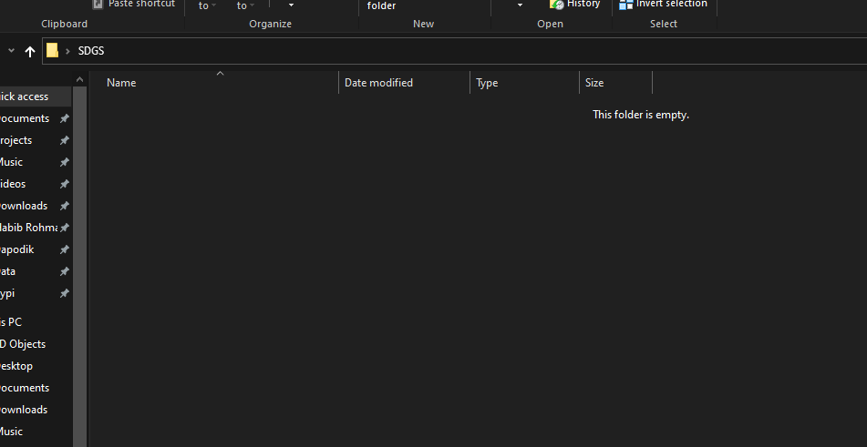
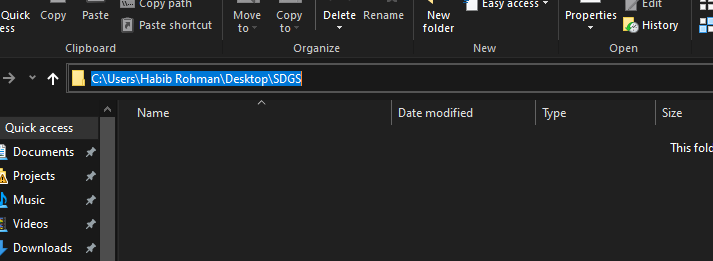
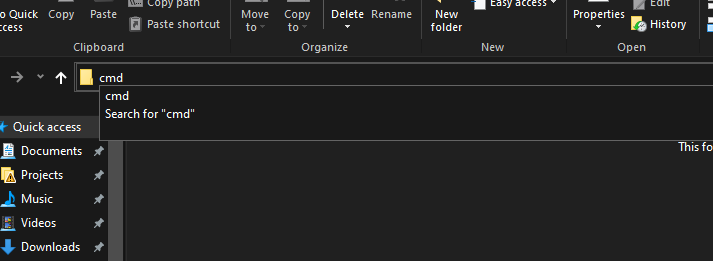
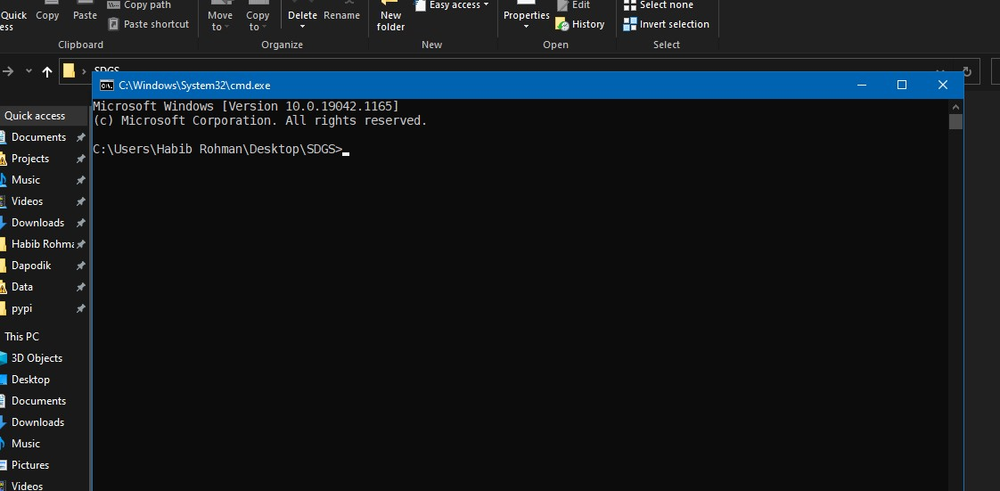
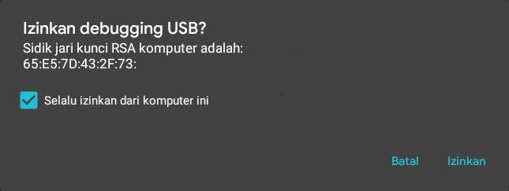

# SDGS Tools

## Daftar Isi

- [SDGS Tools](#sdgs-tools)
  - [Daftar Isi](#daftar-isi)
  - [Open Donasi](#open-donasi)
  - [Penyiapan Folder](#penyiapan-folder)
  - [Cara menjalankan perintah](#cara-menjalankan-perintah)
  - [Cara Install](#cara-install)
  - [Menyiapkan Perangkat Android](#menyiapkan-perangkat-android)
  - [Membuat Template dan Mempersiapkan Data](#membuat-template-dan-mempersiapkan-data)
    - [Template Individu](#template-individu)
    - [Template Keluarga](#template-keluarga)
  - [Eksport Data Individu](#eksport-data-individu)
  - [Eksport Data Keluarga](#eksport-data-keluarga)

## Open Donasi

Alat ini membutuhkan banyak sumber daya (khususnya waktu & fikiran) dalam pembuatannya. Apabila Anda merasa terbantu dengan adanya alat ini, Anda dapat melakukan donasi di <https://saweria.co/hexatester> atau pm <https://t.me/hexatester> (untuk transfer bank). Berapapun jumlahnya tentu akan sangat membantu saya untuk membuat inovasi baru dan melanjutkan pendidikan saya, terimakasih.

## Penyiapan Folder

Buat Folder Baru khusus untuk file-file yang akan dipakai nanti.

## Cara menjalankan perintah

Karena alat ini tidak memiliki tampilan (hanya perintah / CLI), maka semua perintah harus dijalankan dengan cmd atau powershell. Berikut cara membuka cmd dalam folder :

1. Buka Folder yang sudah disiapkan

   

2. Klik / blok alamat folder

   

3. Ketik cmd, kemudian tekan enter

   

4. Maka akan muncul jendela cmd

   

5. Perintah dapat diketik dalam jendela tersebut dan tekan enter untuk menjalankannya, **PERINTAH HARUS DIMASUKKAN DENGAN BENAR SALAH SEDIKIT ALAT TIDAK DAPAT BERJALAN / ERROR**.

## Cara Install

Penginstallan dilakukan **satu kali** untuk setiap laptop / komputer (selanjutnya disebut PC). Disarankan menggunakan pc dengan RAM minimal 4GB dengan Sistem Operasi Windows 10 atau Linux. Berikut langkah-langkahnya :

1. [Download](https://androiddatahost.com/uq6us "Link Download ADB") dan [Install](https://androidmtk.com/install-minimal-adb-and-fastboot-tool "Cara Install ADB") ADB
2. [Download](https://github.com/hexatester/sdgs-tools/releases/download/v0.7.10/sdgs-tools.exe "Aplikasi SDGS Tools") aplikasi sdgs tools
3. Masukkan aplikasi tersebut ke dalam folder yang sudah disiapkan
4. Jika aplikasi hilang, matikan antivirus atau buat pengecualian untuk folder yang disiapkan.

## Menyiapkan Perangkat Android

Penyiapan ini dilakukan untuk setiap perangkat yang digunakan atau terinstall aplikasi sdgs. Pastikan aplikasi sdgs dapat berjalan dan data masih ada. Berikut langkah-langkahnya :

1. Aktifkan Pilihan Pengembang

   Dengan mengetuk nomor versi atau build number beberapakali. Cara menemukan nomor versi
   - Google Pixel: Pengaturan > Sistem > Tentang ponsel > Nomor versi
   - Samsung Galaxy S8 and later: Pengaturan > Tentang ponsel > Informasi Perangkat Lunak > Nomor versi
   - LG G6 and later: Pengaturan > Tentang ponsel > Info Perangkat Lunak > Nomor versi
   - HTC U11 and later: Pengaturan > Tentang > Informasi Perangkat Lunak > More > Nomor versi
   - Xiaomi: Pengaturan > Tentang Ponsel > Versi MIUI

   > Khusus untuk xiaomi yang diketuk adalah Versi MIUI

2. Sambungkan hp dengan pc menggunakan **kabel data**
3. Izinkan debugging USB

   Centang *Selalu izinkan dari komputer ini*
   

   Jika menu tersebut tidak muncul pastikan ADB sudah terintall dan jalankan perintah `adb devices`.

4. Kecilkan Ukuran Tampilan di Pengaturan > Aksesbilitas > Ukuran tampilan (Display Size) > Terkecil. *Dapat dembalikan jika sudah selesai export*.
5. Nyalakan GPS!
6. Buka Aplikasi SDGS!

## Membuat Template dan Mempersiapkan Data

Template digunakan untuk menentukan data yang akan diekspor dan tempat hasil ekspor data.

### Template Individu

Buat template excel untuk data individu dengan menjalankan perintah

```cmd
sdgs-tools aplikasi template-individu "<nama file>"
```

Misalnya, `sdgs-tools aplikasi template-individu "DATA INDIVIDU"` akan membuat template excel dengan nama `DATA INDIVIDU`

### Template Keluarga

Buat template excel untuk data keluarga dengan menjalankan perintah

```cmd
sdgs-tools aplikasi template-keluarga "<nama file>"
```

Misalnya, `sdgs-tools aplikasi template-keluarga "DATA KELUARGA"` akan membuat template excel dengan nama `DATA KELUARGA`

## Eksport Data Individu

Sebelum melakukan eksport harap [siapkan perangkat android](#menyiapkan-perangkat-android) terlebih dahulu dan **matikan data seluler / wifi** agar proses tidak terganggu.
Isi [template individu](#template-individu) dengan data rt rw, nomor kk dan nik.

Buka SURVEY INDIVIDU dan eksport data dengan menjalankan perintah

```cmd
sdgs-tools aplikasi export-individu
```

Pilihan yang tersedia

- `--ranges` untuk menentukan baris keberapa yang diekspor, misal `--ranges "2-100,150-200"` akan mengekspor data individu yang ada di baris 2 sampai 100 dan 150 sampai 200.
- `--baris-penghasilan` awal baris yang diisi di sheet Penghasilan
- `--no-individu` untuk melewati ekspor data di tab DATA INDIVIDU
- `--no-pekerjaan` untuk melewati ekspor data di tab PEKERJAAN
- `--no-pengasilan` untuk melewati ekspor data di tab PENGASILAN
- `--no-kesehatan` untuk melewati ekspor data di tab KESEHATAN
- `--no-disabilitas` untuk melewati ekspor data di tab DISABILITAS
- `--no-pendidikan` untuk melewati ekspor data di tab PENDIDIKAN

Contoh menggunakan pilihan

```cmd
sdgs-tools aplikasi export-individu --ranges "2-100" --baris-penghasilan "10" --no-pengasilan
```

## Eksport Data Keluarga

Sebelum melakukan eksport harap [siapkan perangkat android](#menyiapkan-perangkat-android) terlebih dahulu dan **matikan data seluler / wifi** agar proses tidak terganggu.
Isi [template keluarga](#template-keluarga) dengan data rt rw, dan nomor kk.

Buka SURVEY KELUARGA dan eksport data dengan menjalankan perintah

```cmd
sdgs-tools aplikasi export-keluarga
```

Pilihan yang tersedia

- `--ranges` ntuk menentukan baris keberapa yang diekspor, misal `--ranges "2-100,150-200"` akan mengekspor data individu yang ada di baris 2 sampai 100 dan 150 sampai 200.
- `--baris-pendidikan` awal baris yang diisi di sheet Pendidikan
- `--baris-kesehatan` awal baris yang diisi di sheet Kesehatan
- `--baris-tenaga_kesehatan` awal baris yang diisi di sheet Tenaga Kesehatan
- `--baris-sarpras` awal baris yang diisi di sheet Sarpras
- `--no-lokasi` untuk melewati ekspor data di tab LOKASI & PEMUKIMAN
- `--no-pendidikan` untuk melewati ekspor data di tab AKSES PENDIDIKAN
- `--no-kesehatan` untuk melewati ekspor data di tab AKSES KESEHATAN
- `--no-tenaga-kesehatan` untuk melewati ekspor data di tab AKSES TENAGA KESEHATAN
- `--no-sarpras` untuk melewati ekspor data di tab AKSES SARANA PRASARANA
- `--no-lain-lain` untuk melewati ekspor data di tab LAIN-LAIN

Contoh menggunakan pilihan

```cmd
sdgs-tools aplikasi export-keluarga --ranges "2-100" --baris-pendidikan "10" --no-kesehatan
```
