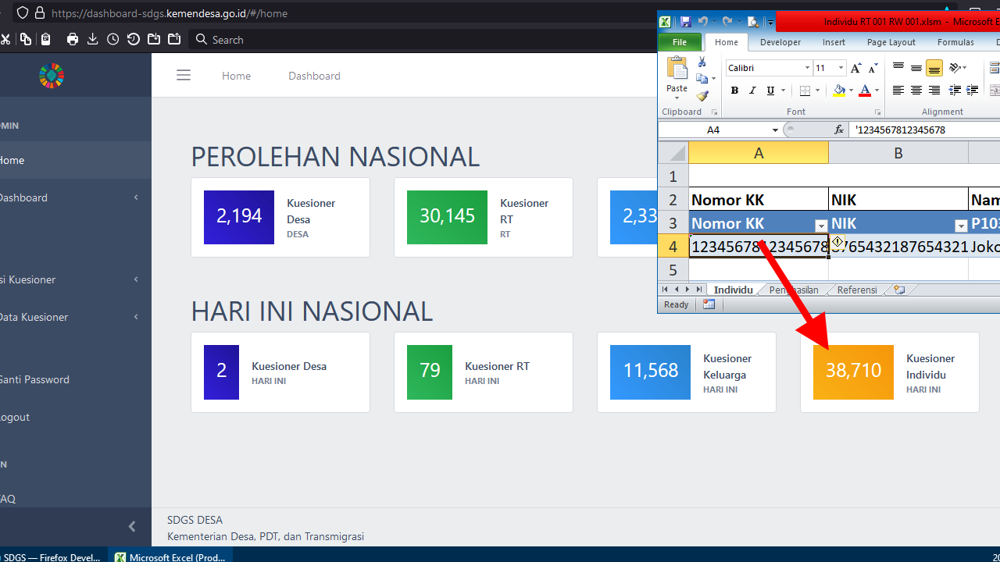

# SDGs Tools

sdgs-tools adalah alat bantu pendataan SDGs Kemendesa buatan [Habib Rohman](https://github.com/hexatester)

Aplikasi ini (sdgs-tools.exe) sama sekali tidak berafiliasi dengan, diizinkan, dipelihara, disponsori atau didukung oleh Kemendesa atau afiliasi atau anak organisasinya. Ini adalah perangkat lunak yang independen dan tidak resmi. Gunakan dengan risiko Anda sendiri.

Jika terjadi error yang tidak terduga harap mengubungi saya via Telegram di <https://t.me/hexatester>
Jika Anda merasa terbantu dengan kreasi saya, Anda dapat melakukan donasi di <https://saweria.co/hexatester>

## Daftar Isi

- [SDGs Tools](#sdgs-tools)
  - [Daftar Isi](#daftar-isi)
  - [Video Tutorial](#video-tutorial)
  - [Download](#download)
  - [Fungsi](#fungsi)
    - [Memasukkan data individu dari excel](#memasukkan-data-individu-dari-excel)
    - [Memasukkan data keluarga dari excel](#memasukkan-data-keluarga-dari-excel)
    - [Mengeluarkan data individu dari aplikasi sdgs android](#mengeluarkan-data-individu-dari-aplikasi-sdgs-android)
    - [Mengeluarkan data keluarga dari aplikasi sdgs android](#mengeluarkan-data-keluarga-dari-aplikasi-sdgs-android)

## Video Tutorial

[Memasukkan Data Excel ke Dashboard SDGs Kemendesa](https://www.youtube.com/watch?v=rXU0YYDwNj0)

## Download

Download aplikasi sdgs-tools.exe [klik di sini](https://github.com/hexatester/sdgs-tools/releases/download/v0.8.3/sdgs-tools.exe)

## Fungsi

- Memasukkan data individu dari excel ke [dashboard-sdgs kemendesa](https://dashboard-sdgs.kemendesa.go.id/)
- Memasukkan data keluarga dari excel ke [dashboard-sdgs kemendesa](https://dashboard-sdgs.kemendesa.go.id/)
- Mengeluarkan data individu dari aplikasi sdgs android ke excel.
- Mengeluarkan data keluarga dari aplikasi sdgs android ke excel

### Memasukkan data individu dari excel

1. [Download aplikasi](#download)
2. Downlaod [template individu dashboard](https://github.com/hexatester/sdgs-tools/releases/download/v0.8.3/Template_Individu-Import-Dashboard_SDGS.xlsm)
3. Salin dan rubah nama file template tersebut sesuai dengan RT / RW.
4. Isi masing-masing file dengan data sesuai dengan RT / RW, pengisian dapat dilakukan secara offline.
5. Jika data sudah siap, sambungkan PC / Laptop ke internet dan buka aplikasi `sdgs-tools.exe`
6. Klik **Dashboard SDGS**
7. Klik **Import Individu**
8. Masukkan *Username* dan *Password* **akun enumerator** dari RT / RW yang akan diinput, *jika setiap enumerator berbeda RT / RW*.
9. Klik Login
10. Isi kolom Baris dengan jarak baris dari template yang sudah diisi, misalnya di template sudah diisi baris ke 4 sampai ke 100. Maka kolom **Baris** di aplikasi diisi `4-100`
11. Isi kolom Rt dan Rw sesuai dengan RT / Rw template yang akan diinput. RT dan RW masing-masing harus 3 digit, misal 001.
12. Klik **Pilih template individu dan mulai import**
13. Tunggu sampai selesai, program jangan diklik.

Ketika melakukan pengisian template sebaiknya menggunakan microsoft excel di pc / laptop, agar dapat mengaktifkan data validation dan macro / content.

### Memasukkan data keluarga dari excel

1. [Download aplikasi](#download)
2. Downlaod [template keluarga dashboard](https://github.com/hexatester/sdgs-tools/releases/download/v0.8.3/Template_Keluarga-Import-Dashboard_SDGS.xlsm)
3. Salin dan rubah nama file template tersebut sesuai dengan RT / RW.
4. Isi masing-masing file dengan data sesuai dengan RT / RW, pengisian dapat dilakukan secara offline.
5. Jika data sudah siap, sambungkan PC / Laptop ke internet dan buka aplikasi `sdgs-tools.exe`
6. Klik **Dashboard SDGS**
7. Klik **Import Keluarga**
8. Masukkan *Username* dan *Password* **akun enumerator** dari RT / RW yang akan diinput, *jika setiap enumerator berbeda RT / RW*.
9. Klik Login
10. Isi kolom Baris dengan jarak baris dari template yang sudah diisi, misalnya di template sudah diisi baris ke 4 sampai ke 100. Maka kolom **Baris** di aplikasi diisi `4-100`
11. Isi kolom Rt dan Rw sesuai dengan RT / Rw template yang akan diinput. RT dan RW masing-masing harus 3 digit, misal 001.
12. Klik **Pilih template keluarga dan mulai import**
13. Tunggu sampai selesai, program jangan diklik.

Ketika melakukan pengisian template sebaiknya menggunakan microsoft excel di pc / laptop, agar dapat mengaktifkan data validation dan macro / content.

### Mengeluarkan data individu dari aplikasi sdgs android

### Mengeluarkan data keluarga dari aplikasi sdgs android
